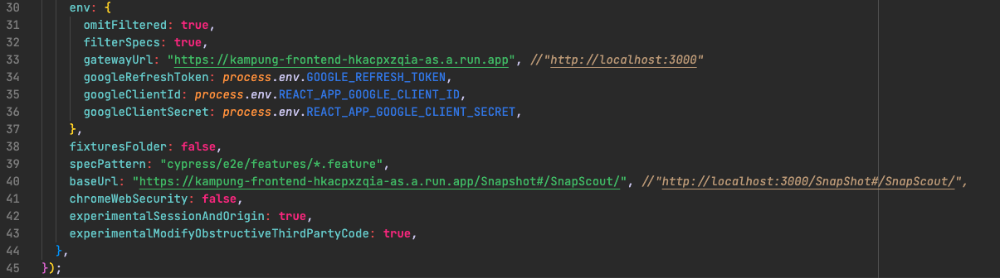

# Kampung.SG

Interfaith LMS in collaboration with Google and Being Bridges

## Deployment

The file structure is as follows.

```text
.
├── api-gateway
│   ├── app
│   ├── Dockerfile
│   ├── cloudbuild.yaml
│   └── ...
├── frontend
│   ├── public
│   ├── src
│   ├── Dockerfile
│   ├── cloudbuild.yaml
│   └── ...
├── users-microservices
│   ├── app
│   ├── Dockerfile
│   ├── cloudbuild.yaml
│   └── ...
└── docker-compose.yml
```

To deploy each service, run `gcloud builds submit` in each service folder.

### Storing secrets

[Detailed guide on GCP](https://cloud.google.com/ruby/rails/run#store_secret_values_in).

Each Rails microservice uses GCP Secret Manager to store the `master.key` to decrypt `credentials.yml.enc`.

```sh
EDITOR=nano rails credentials:edit
```

After adding/editing the secrets, upload the value in `master.key` and save the secret as **SECRET_NAME**.

When viewing the secret details, obtain the **PROJECT_ID** value in `projects/<PROJECT_ID>/secrets/<SECRET_NAME>`.

Under `Permissions > Grant Access`, assign _Secret Manager Secret Accessor_ to the accounts:

- `<PROJECT_ID>@cloudbuild.gserviceaccount.com`
- `<PROJECT_ID>-compute@developer.gserviceaccount.com`

Then in the service's corresponding `cloudbuild.yaml`, edit `substitutions:_SECRET_NAME` to **SECRET_NAME**.

## Local Development

Always make sure to `git pull` before you `git commit` your changes.

### Running the app

#### Mac (Silicon)

In order to run all the microservices, please make sure that the stock terminal app is turned off before you do the following while `kampung` is your current working directory

```shell
sh start_dev.sh
```

This will launch the web app running on local host and will also turn on Cypress for testing.

##### Troubleshooting on Mac (Silicon)

```shell
sh restart_mac_dev.sh
```

Use this to troubleshoot your local installation as it re-downloads all the dependencies in each microservice.

### Docker Compose

To run each service with its own containers, run this command in the root directory:

```sh
docker compose up -d
```

### Ports

| Service        | Port |
| -------------- | ---- |
| React Frontend | 3000 |
| API Gateway    | 3001 |
| Curriculum     | 3002 |
| Forum          | 3003 |
| Users          | 3004 |
| ML             | 3005 |
| Inactivity     | 3006 |

## Automated Cucumber Tests done with Cypress for Behaviour-Driven Development

The automated tests are done with [Cypress](https://docs.cypress.io/guides/overview/why-cypress) to simulate user behaviour on the Kampung.SG platform.

To check for the finalised reports ran on our deployed website please see the following file
```
frontend/mochawesome-report/mochawesome.html
```

For the full feature file for each of the tests you can visit
```
frontend/cypress/e2e/features
```

For the test code
```
frontend/cypress/e2e/step_definitions
```

Some of our custom-made commands are on
```
frontend/cypress/e2e/support/commands.js
```

### Running the tests

#### On deployment
- To run the tests on deployment simply run the following (assuming `frontend` is your working directory)

**To see Cypress GUI**
```
npx cypress open
```
**To run Cypress tests on the CLI**
```
npx cypress run
```

#### Locally
Make sure to change the `gatewayURL` and the `baseURL` based on which port the react app is running. In the following example, and as per this documentation, the port will be `3000` and is commented out in the image below.
**Make sure to uncomment it**

- On `cypress.config.js`


